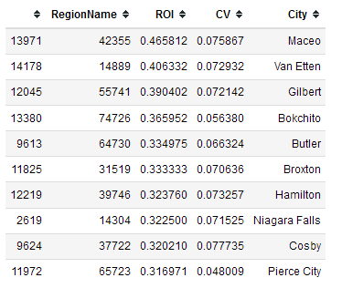
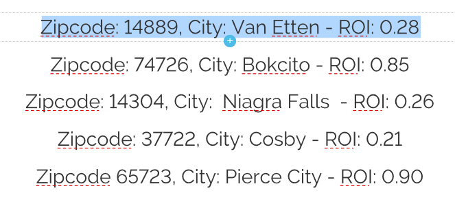

# Table of contents

- Purpose

- Synopsis

- Analysis

- Wayforward

# Purpose

Given house price dataset by Zillow, to find 5 zipcodes to invest between $90K - $110K. This README will also serve as a general outline and explanation of the analysis and development process.


# Synopsis

The data provided by Zillow is very clean and contain no missing values apart from the 'Metro' field that this project will not use. The idea is to find 5 zipcodes that can be invested in and to provide a return on investment across these zipcodes over a 24 month timespan. Time-Series modelling is used to achieve this, specifically the SARIMA model.

# Zipcode Selection


## Filtering the zipcodes

Assumptions have been made about the criteria for investment. 

1 - The Relative Standard Deviation of the zipcode should be in the 0.6 quartile of the dataset.
2 - This will then be further filtered by highest ROI and then 10 zip codes will be modeled and then from this 5 will be selected based on the quality of the projection.



## Best 5 Zip codes

The best 5 zip codes are:




# Way forward

- Incorporate additional datasets along with neural networks for better timing
- Look at investing in more liquid financial instruments that are traded for frequently to reduce risk and inprove model


```python

```
